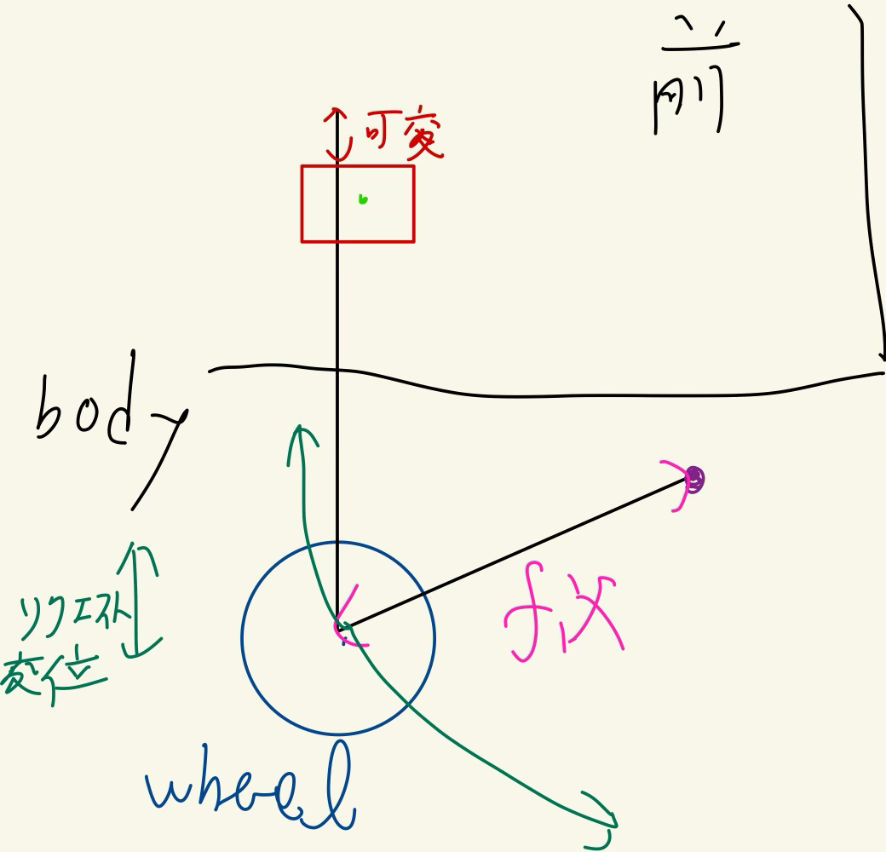

# つくばチャレンジ用フロントサスペンション設計 引き継ぎメモ

更新日: 2026-09-21  
用途: Codex / CAD / 設計計算へ引き継ぐための技術仕様メモ  
状態: **概念設計フェーズ。サスペンション形式はほぼ決定、寸法・ばね・ダンパ・ストロークは未確定。**

---

## 0. このドキュメントでやりたいこと

このロボットの前輪サスペンションについて、以後の作業を Codex 側でそのまま継続できる状態にする。

最終的な狙いは次の通り。

- つくばチャレンジの低速屋外走行で、縁石・舗装段差・角の立った垂直段差に強い。
- 前輪はオムニホイールなので、サスペンションストローク中も **キャンバを極力変えない**。
- 後輪は **リジッド駆動軸**。前輪側のみ独立懸架とする。
- 高性能化のために複雑なリンクを増やすのではなく、**少ない部品点数・低価格・高ロバスト性**を優先する。
- 「段差入力を無理やりばねで吸収する」のではなく、まず **ホイール中心軌跡そのものを段差反力に対して有利にする**。
- ばね・ダンパ位置はその後に決める。

この順番は重要。先にショック位置を決めてはいけない。

---

## 1. 現在の車両アーキテクチャ

### 固定に近い条件

- 4輪。
- 後輪: リジッド駆動軸。
- 前輪: 左右独立オムニホイール。
- 後輪は駆動軸。前輪駆動については現会話では明示されていないため、**初期解析では前輪非駆動を仮定し、既存CAD/配線/駆動系から確認すること**。前輪非駆動なら、後輪側から車体を押して前輪が段差を乗り越える。
- 前輪オムニホイールは、できる限り鉛直姿勢を維持する。
- 前輪にオシレーティングアクスルは使わない。
  - 理由: 左右輪をビームごとロールさせると、オムニホイール自体が傾く。
  - オムニローラの接触状態が崩れやすいため、今回の要求と相性が悪い。

### ほぼ本命の形式

**左右独立の single-pivot trailing arm / trailing link**

ここでいう trailing arm は、進行方向に対して

- ピボットが車輪中心より **前方**
- 車輪中心がピボットより **後方**

にある構成を指す。

さらに、垂直段差性能を狙うため、ピボットを車輪中心より **上方** に置く。

つまり側面視では

```text
進行方向 +x →

       P: pivot
       o
        \
         \
          O  front omni wheel

P は O より「前かつ上」
O は P より「後ろかつ下」
```

この構成で、バンプ時のホイール中心は **後ろへ逃げながら上がる**。

---

## 2. 重要な訂正事項 — 以前の逆向きスイングアーム案は採用しない

以前の検討途中で、

- ピボットが車輪より後方
- 車輪がピボットより前方

という図が出たが、これは今回の「垂直段差に強い前輪」を狙う配置としては不適切。

その配置では、バンプ時にホイール中心が前上方へ移動しやすく、垂直段差から受ける後方反力と運動方向が対立しやすい。

厳密には「どんな段差でも必ず完全にロックする」という意味ではない。しかし、段差高が大きくなり水平反力成分が増えるほど、今回の目的に対して不利になる。

**以後は前方・上方ピボットの trailing-arm 配置を基準にする。**

---

## 3. 座標系と記号

解析は側面 2D から始める。

- `+x`: 車両進行方向
- `+z`: 上方向
- 前輪ピボットを原点 `P=(0,0)` とする
- 静止状態の車輪中心 `W0=(-a,-b)`

ここで

- `a > 0`: ピボットから車輪中心までの前後距離
- `b > 0`: ピボットが車輪中心より高い量
- `L = sqrt(a^2+b^2)`: アーム長

```text
z ↑
  |
  |      P=(0,0)
  |      o
  |       \
  |        \
  |         O W0=(-a,-b)
  +----------------------→ x
```

前輪がバンプ方向へ動く回転角を `α >= 0` とし、時計回りを圧縮方向と定義する。

---

## 4. trailing arm の正確なホイール軌跡

静止状態から `α` だけ圧縮したときの車輪中心位置は

```math
x_w(α) = -a cos α - b sin α
```

```math
z_w(α) =  a sin α - b cos α
```

静止状態 `α=0` では

```math
x_w(0)=-a,
\qquad
z_w(0)=-b
```

微分すると

```math
\frac{dx_w}{dα}=a\sin α-b\cos α
```

```math
\frac{dz_w}{dα}=a\cos α+b\sin α
```

初期状態では

```math
\left.\frac{dx_w}{dα}\right|_{α=0}=-b
```

```math
\left.\frac{dz_w}{dα}\right|_{α=0}=a
```

したがって初期バンプ方向は

```math
(\Delta x,\Delta z) \propto (-b,+a)
```

つまり

> **後方 + 上方**

となる。

初期の rearward / upward 比は

```math
\frac{|\Delta x|}{\Delta z} \approx \frac{b}{a}
```

で決まる。

この `b/a` は今回の重要な設計変数。

---

## 5. なぜ垂直段差に rearward-upward axle path が効くか — 「車体相対」と「地面絶対」を混同しない

半径 `R` の理想円形車輪が、高さ `h` の垂直な角付き段差に接触するとする。

ここでは

```math
0 < h < R
```

の範囲を考える。

段差角から車輪中心までの水平距離は

```math
s = \sqrt{2Rh-h^2}
```

段差角から車輪中心への単位法線方向は

```math
\hat{n}
=
\frac{1}{R}
\begin{bmatrix}
-s\\
R-h
\end{bmatrix}
```

つまり段差から車輪に入る反力は、概ね

- 後方
- 上方

の両成分を持つ。

ここで非常に重要なのは、以下で扱う trailing-arm の wheel path は **シャーシに対する相対運動** だということ。

ロボット全体は地面に対して前進しているため、段差乗越し中の wheel center の絶対軌跡が地面に対して後退する必要はない。通常は chassis の前進量に rearward suspension travel が重なり、絶対軌跡は前方 + 上方になり得る。

したがって「rearward axle path」は、車輪を地面に対して後退させることが目的ではなく、**段差接触反力の後方成分を suspension DOF に逃がし、chassis に直接伝わる衝撃・必要反力を減らす自由度を作る**ことが目的。

一方、trailing arm の初期ホイール相対移動方向は

```math
\hat{t}
=
\frac{1}{L}
\begin{bmatrix}
-b\\
a
\end{bmatrix}
```

なので、接触反力が suspension 回転自由度へどれだけ強く結合するかを見る一次指標として

```math
C_q
=
\hat{t}_{rel}\cdot\hat{n}
=
\frac{bs+a(R-h)}{LR}
```

を使える。

`C_q=1` は **接触反力方向とシャーシ相対 wheel motion が平行で、接触反力の suspension DOF への一般化力結合が最大** という意味。

これは「wheel center の地面に対する絶対軌跡が反力方向へ動く」という意味ではない。また `C_q=1` が車両全体として必ず最適という意味でもない。spring force、rear traction、chassis motion、clearance まで含めて最終判断すること。

初期 geometry の強い候補として、一般化力結合を最大化するなら

```math
\frac{b}{a}
=
\frac{s}{R-h}
=
\frac{\sqrt{2Rh-h^2}}{R-h}
```

になる。

これは今回かなり有用な **初期候補生成式**。最終最適式ではない。

### 例

`h/R` と必要な `b/a` の目安:

| `h/R` | `s/R` | `s/(R-h)` | 軌跡角: 鉛直から後方 |
|---:|---:|---:|---:|
| 0.05 | 0.312 | 0.329 | 約18° |
| 0.10 | 0.436 | 0.484 | 約26° |
| 0.20 | 0.600 | 0.750 | 約37° |
| 0.30 | 0.714 | 1.020 | 約46° |
| 0.40 | 0.800 | 1.333 | 約53° |

注意:

- これは **理想円形車輪 + 角付き段差 + 初期瞬間 + chassis-relative suspension kinematics** の一次近似。
- オムニホイールは局所ローラ形状があるため、このモデル通りにはならない。
- それでも、ピボット候補を絞るための最初の物理モデルとしては有効。

### 接触拘束まで含めた正しい関係

地面固定座標で、pivot の位置を `P_g`、step corner を `C`、wheel center を

```math
W_g=P_g+r(α)
```

とする。理想剛体円が段差角に接触している間の拘束は

```math
g=\|W_g-C\|-R=0
```

これを時間微分すると

```math
\hat n\cdot
\left(
V_P+rac{\partial r}{\partial α}\dot α
\right)=0
```

となる。

つまり、chassis/pivot の前進速度 `V_P` の法線方向成分を、trailing arm の rearward-upward 相対運動で打ち消しながら、wheel center の**絶対速度を接触拘束に適合させる**。

接触反力を `λ\hat n` とすると suspension 座標 `α` への一般化力は

```math
Q_α
=
λ\hat n\cdot\frac{\partial r}{\partial α}
```

となる。

したがって Codex の最終モデルでは、単なる方向一致 `C_q` だけではなく

```math
Q_α + Q_{spring} + Q_{damper} + Q_{gravity} + Q_{inertia}=0
```

と接触拘束を同時に解くこと。

最初は quasi-static 2-DOF (`x_chassis`, `α`) で十分。その後必要なら chassis pitch を追加する。

---

## 6. ピボットに入るモーメントを見ると、向きの違いがさらに明確

静止状態で

```math
\mathbf{r}=(-a,-b)
```

段差反力を

```math
\mathbf{F}=(-F_x,+F_z)
```

とする。`F_x>0`, `F_z>0`。

ピボットまわりモーメントは

```math
τ = r_x F_z-r_z F_x
```

なので

```math
τ=-aF_z-bF_x
```

となる。

今回の定義では時計回りがバンプ方向なので、この負トルクは **常に圧縮方向**。

つまり前上ピボットの trailing arm では、

- 段差反力の上向き成分
- 段差反力の後ろ向き成分

の両方がサスペンションを逃がす側へ働く。

これは非常に都合がよい。

---

## 7. 逆向きピボットが段差に弱い理由

ピボットを車輪中心より後ろに置くと、静止ベクトルは概ね

```math
\mathbf{r}=(+a,-b)
```

になる。

このとき

```math
τ=aF_z-bF_x
```

となり、

- 上向き反力 `F_z` は圧縮を助ける
- 後ろ向き反力 `F_x` は圧縮を妨げる

という競合になる。

大きな垂直段差ほど `F_x/F_z` が増えるので不利。

したがって今回の目的には使わない。

---

## 8. リジッド車輪の垂直段差乗越しに必要な水平力 — 基準値

理想的な剛体円形車輪が、サスペンション無しで垂直段差を乗り越える瞬間を考える。

段差角を回転中心として静力学的につり合わせると

```math
F(R-h)=Ws
```

よって

```math
F
=
W\frac{\sqrt{2Rh-h^2}}{R-h}
```

ここで

- `W`: 車輪に作用する鉛直荷重
- `F`: 車体から必要な前向き押力

となる。

`h/R` が大きくなるほど必要水平力が急増する。

例:

| `h/R` | `F/W` |
|---:|---:|
| 0.10 | 0.484 |
| 0.20 | 0.750 |
| 0.30 | 1.020 |
| 0.40 | 1.333 |
| 0.50 | 1.732 |

`h → R` で理想モデル上は必要水平力が発散する。

したがって段差性能の優先順位は概ね

1. ホイール半径 `R`
2. ターゲット段差高 `h`
3. 前輪荷重
4. ホイール中心軌跡
5. 後輪の駆動力・摩擦余裕
6. サスペンションストローク
7. ばね・減衰

と考えるべき。

ばねだけ柔らかくしても根本解決にはならない。

---

## 9. オムニホイール特有の注意

今回の円形車輪モデルは、オムニホイールに対しては近似に過ぎない。

オムニホイールは外周に自由ローラがあり、段差角と接触する局所形状が通常タイヤと異なる。

重要な懸念:

- 段差角がローラ間の谷に入る可能性。
- ローラが意図しない方向へ回転し、必要な接触反力を作りにくい可能性。
- 接触半径がホイール公称半径 `R` より実質的に小さくなる瞬間がある。
- ホイールの回転位相により段差性能が変わる可能性。
- 斜め侵入時はさらに複雑。

したがって Codex 側の解析では

### Level 1

理想円 `R` として解析。

### Level 2

実オムニホイールの外周包絡線、ローラ径、ローラ本数、ローラ位相を入れた 2D 幾何モデル。

### Level 3

実機段差試験。

の順で進める。

**最終判断は Level 3 を優先する。**

---

## 10. 前輪非駆動と仮定した場合、後輪が駆動軸であることの意味

これは重要。ただし前輪が本当に非駆動かは既存設計で確認すること。以下は非駆動前提。

前輪が駆動輪ならホイール自身の接線駆動力を段差乗越しに使えるが、今回は後輪駆動。

したがって前輪は

1. 後輪が車体を前へ押す
2. シャーシが front trailing-arm pivot を前へ押す
3. 前輪が段差角から反力を受ける
4. その反力で front trailing arm が後上方へ逃げる
5. 後輪はその間も必要な推進力を出す

という系になる。

よってサスペンションだけでなく、後輪の接地荷重と摩擦余裕も同時に確認すること。

最低限 Codex で

```math
F_{drive,max}=μN_{rear}
```

を置き、段差乗越し中に

```math
F_{required}<F_{drive,max}
```

か確認する。

必要なら、車体ピッチと静的荷重移動も含める。

---

## 11. ばね位置はまだ決めない — 役割を分離して考える

重要:

> **ホイール軌跡を決めるのはピボット位置。**
>
> **ばね位置が決めるのは主として wheel rate / shock travel / shock force / packaging。**

したがって順番は

1. ターゲット段差を決める
2. `R, h` から望ましい axle path を決める
3. `a, b, L, travel` を決める
4. 車体干渉を確認する
5. その後でばね位置を決める

とする。

---

## 12. ばね・ダンパ配置の候補

### A. ホイール寄りに直接コイルオーバ

```text
pivot o------------------O wheel
                |
                |
             spring/
             damper
                |
              body
```

特徴:

- motion ratio を 1 に近づけやすい。
- ショック必要荷重を下げやすい。
- ショックストロークを大きく使える。
- チューニングしやすい。
- 外側に張り出しやすい。
- 泥、水、人との接触から保護しにくい。

### B. ピボット寄りの inboard コイルオーバ

```text
body
 |\
 | shock
 |   \
 o----x-------------O
pivot lower mount   wheel
```

特徴:

- 外側がすっきりする。
- 部品を車体内部に守れる。
- shock motion ratio が小さくなりやすい。
- 同じ wheel rate を作るため、より高い spring rate が必要。
- 同じ wheel load に対し shock force が大きくなりやすい。
- 小さい motion ratio にしすぎるとダンパ速度も小さくなり、減衰調整が鈍くなる。

### C. ピボット部のトーションスプリング

特徴:

- 非常にコンパクト。
- ロッド・上下アイ不要。
- 部品点数を減らせる。
- 別途ダンパが必要になりやすい。
- 適切なトーションばねの入手性を要確認。
- ピボット部荷重と構造が集中する。

### D. ウレタン / ゴムエラストマ

特徴:

- 安い。
- ばね + 材料ヒステリシスによる一部減衰が得られる。
- bump stop と兼用しやすい。
- 非線形性が強い。
- 温度依存・経時変化・個体差がある。
- センサの振動絶縁を厳密に設計したい場合は読みづらい。

### E. ロッカー / プッシュロッド / プルロッド

原理上は可能だが、現時点では優先しない。

理由:

- 部品点数が増える。
- ピボットとベアリングが増える。
- ガタ源が増える。
- 6 km/h 以下のロボットで得られる性能メリットに対して過剰になりやすい。

ただし、パッケージ都合で direct shock が成立しない場合のみ再検討。

---

## 13. Motion Ratio の定義を固定する

このプロジェクトでは混乱防止のため

```math
MR=\frac{\Delta s_{spring}}{\Delta z_{wheel}}
```

と定義する。

つまり **spring displacement / wheel vertical displacement**。

この定義なら

```math
F_{wheel}=F_{spring}\,MR
```

```math
k_{wheel}=k_{spring}\,MR^2
```

線形ダンパの小変位近似では

```math
c_{wheel}=c_{damper}\,MR^2
```

となる。

`MR<1` なら

- spring は wheel より少ししか動かない
- spring force は wheel force より大きく必要
- spring rate は wheel rate より大きく必要

ということ。

---

## 14. 任意ショック配置の Motion Ratio を正確に求める方法

### 下側ショックマウント

アーム上の lower mount をピボットからの比率 `ρ` で置く。

静止状態で

```math
S_0=(-ρa,-ρb)
```

とする。

圧縮角 `α` のとき

```math
x_s(α)=-ρa\cos α-ρb\sin α
```

```math
z_s(α)= ρa\sin α-ρb\cos α
```

### 上側固定マウント

```math
U=(x_u,z_u)
```

### ショック長

```math
\ell(α)
=
\sqrt{(x_s-x_u)^2+(z_s-z_u)^2}
```

### 微分

```math
\frac{d\ell}{dα}
=
\frac{(x_s-x_u)\frac{dx_s}{dα}+(z_s-z_u)\frac{dz_s}{dα}}
{\ell}
```

一方

```math
\frac{dz_w}{dα}=a\cos α+b\sin α
```

したがって

```math
MR(α)
=
\left|
\frac{d\ell/dα}{dz_w/dα}
\right|
```

これを全ストロークに対してプロットする。

**一定 MR と決め打ちしない。**

---

## 15. spring rate の初期算定

前輪 1 輪あたりの静荷重を

```math
F_{w,static}
```

目標 sag を

```math
\delta z_{sag}
```

とすると、preload 無視の一次近似 wheel rate は

```math
k_{wheel}
\approx
\frac{F_{w,static}}{\delta z_{sag}}
```

必要 spring rate は

```math
k_{spring}
\approx
\frac{k_{wheel}}{MR^2}
```

ただし実際は

- preload
- MR の変化
- shock angle
- bump stop
- unsprung mass
- エラストマ非線形

を加える。

最初は簡単なモデルで良い。

---

## 16. ダンパについて

垂直段差性能を狙うなら、単純に compression damping を強くしない。

線形モデルでは

```math
F_d=c\dot{s}
```

なので、高速な段差入力ではダンパ力が急増する。

圧側減衰を強くしすぎると、せっかく rearward-upward axle path を作っても、短時間だけ実質的に硬いサスペンションになる。

初期方針:

- compression: 弱めから開始
- rebound: 必要に応じて増やす
- bottom-out: bump rubber / elastomer で守る

ただし RC 用等の安価なダンパを使う場合、実際の減衰係数は仕様値だけでは読みづらい可能性があるため、簡易 drop test / force-velocity test を優先する。

---

## 17. Codex で探索すべき設計変数

最低限:

```text
R               wheel nominal radius
h_target_min    target minimum step height
h_target_max    target maximum step height

a               pivot longitudinal offset
b               pivot vertical offset
L               arm length = sqrt(a^2+b^2)
alpha_max       max compression arm rotation
rho             shock lower mount radius ratio
x_u, z_u        shock upper mount position
k_s             spring rate
preload         spring preload
c_comp          compression damping
c_rebound       rebound damping
z_bumpstop      bump stop engagement point
```

追加:

```text
m_total
m_sprung_front_corner
front_static_load
rear_static_load
wheelbase
track
CG_x
CG_z
mu_rear
shock_min_length
shock_max_length
shock_max_force
body_clearance
minimum_ground_clearance
```

---

## 18. 最適化指標

単一目的にしない。

### Objective 1: 段差反力の suspension DOF への結合と接触拘束

各 `h` でまず補助指標

```math
C_q(h,α)=\hat{t}_{rel}(α)\cdot\hat{n}(h)
```

を計算する。これは contact force が suspension DOF に入る一般化力結合の指標。

ただし `C_q` 単独最大化を目的関数にしない。接触拘束

```math
\hat n\cdot(V_P+t_{rel}\dot α)=0
```

と spring / damper equilibrium を同時に解き、必要 contact force `λ`、必要 chassis push force、shock force を評価する。

初期 parameter sweep では `C_q` を候補枝切りに使い、最終 ranking は coupled model で行う。

### Objective 2: 必要後輪駆動力を抑える

理想円モデル + サスペンション仮想仕事から、必要な chassis push force を推定する。

後輪摩擦限界

```math
F_{drive,max}=μN_{rear}
```

に十分な余裕を持たせる。

### Objective 3: ショック荷重

```math
F_{shock,max}
```

を小さくする。

### Objective 4: ショックストローク利用率

市販ショックを使うなら

```math
stroke_utilization
=
\frac{used\ stroke}{available\ stroke}
```

を適切にする。

極端に小さいと damping resolution が悪くなる。

### Objective 5: 部品点数 / コスト / 質量

- bearings
- rod ends
- brackets
- machined parts
- shock count
- custom parts

をペナルティに入れる。

### Objective 6: クリアランス

- tire / body
- arm / floor
- arm / obstacle
- shock / frame
- full bump
- full rebound

を全域でチェック。

---

## 19. Constraints

必須:

```text
wheel camber ≈ 0 during travel
left/right front independent
no interference at full bump/rebound
shock length within allowed stroke
no MR singularity
bump stop before structural hard-contact
rear drive traction margin > 0
minimum ground clearance maintained
moving parts safely guarded
```

さらに

- shock lower/upper mount に無理な side load を入れない。
- rod end を使うなら許容ミスアライメントを確認。
- ボルトを単純せん断一本で雑に使う場合も、曲げを含めて確認。
- アーム根元は段差時に大きな瞬間モーメントを受けるので、ベアリング間距離を極端に狭くしない。
- オムニホイールの軸はサスペンションストローク中もできるだけ水平を維持する。

---

## 20. rearward axle path を強くしすぎる場合の欠点

`b/a` を大きくすれば良いわけではない。

デメリット:

- wheelbase が圧縮時に大きく短くなる。
- wheel が body 側へ大きく引き込まれる。
- wheel / chassis interference が増える。
- full bump 時に地面・段差とのアーム干渉が増える可能性。
- 同じ上下 travel に必要な arm rotation が増える条件がある。
- shock MR が非線形になりやすい。
- rebound 時に wheel が前方へ戻るので、連続段差では rebound damping の影響が出る。

したがって target step range に合わせて必要十分な rearward component にする。

---

## 21. サスペンションアーム自体が段差に当たらないか必ず確認

これは見落としやすい。

車輪が段差を乗り越えられても、アーム下面が段差上端に当たれば終了。

Codex / CAD で

1. wheel circle
2. step rectangle
3. arm swept volume
4. bracket swept volume
5. shock swept volume

を同時に描き、段差接触前から full bump まで collision check する。

特に pivot が高すぎる / arm が低い直線材の場合、段差上端と arm が干渉しうる。

アーム断面を段差側で上に逃がす形状も候補。

---

## 22. オムニホイール姿勢

今回の front suspension では wheel carrier を arm に固定し、side view の単一回転だけ許す。

アームピボット軸と wheel axle は原則平行。

これにより理想剛体モデルでは

- camber change = 0
- toe change = 0

にできる。

ここは double wishbone より single trailing arm が有利な理由の一つ。

---

## 23. なぜ sliding pillar を第一候補にしないか

純上下運動なら sliding pillar / linear guide も成立する。

しかし今回の要求では trailing arm を優先する。

理由:

- 純上下軌跡は square-edge step の後方反力を逃がしにくい。
- outdoor で linear guide に泥・砂・水が入る。
- stick-slip / seal friction / misalignment が出やすい。
- guide に wheel offset の曲げモーメントが入る。
- 加工精度要求が trailing-arm pivot より高い。

ただし比較候補として simulation に残しても良い。

---

## 24. なぜ oscillating axle を使わないか

通常の農機・AGVなら oscillating axle は安価で非常に強い候補。

今回は front omni wheel なので採用しない。

理由:

- axle beam がロールすると wheel plane 自体が傾く。
- omni roller contact を悪化させる。
- left/right wheel の independent vertical compliance を失う。

後輪については既に rigid drive axle という条件なので、そちらにも適用しない。

---

## 25. つくばチャレンジ側の上位制約

2026 ロボット仕様では少なくとも以下を満たす必要がある。

- 最高速度: 6 km/h 以下
- 重量: 125 kg 以下
- 全長: 1.2 m 以下
- 全幅: 0.7 m 以下
- 公道実環境での安全が前提
- 危険な突起部や巻き込み構造を避ける

サスペンションについては、性能だけでなく

- 指挟み
- 服や足の巻き込み
- 露出ばね
- 動くアーム端

のガードまで CAD に入れること。

---

## 26. まず Codex にやらせる解析

### Task 1 — 2D kinematics model

Python で以下を実装。

入力:

```yaml
wheel_radius_mm:
step_heights_mm:
pivot_a_mm:
pivot_b_mm:
alpha_range_deg:
```

出力:

- wheel center trajectory
- rearward displacement vs vertical displacement
- `dx/dz`
- arm angle
- obstacle reaction direction for each `h`
- alignment `C`

### Task 2 — shock model

入力:

```yaml
rho:
shock_upper_x_mm:
shock_upper_z_mm:
shock_free_length_mm:
shock_min_length_mm:
shock_max_length_mm:
spring_rate_N_per_mm:
preload_mm:
```

出力:

- shock length vs wheel travel
- MR vs wheel travel
- spring force vs wheel travel
- wheel force vs wheel travel
- wheel rate vs wheel travel
- progressive / regressive classification

### Task 3 — collision model

最低 2D でよい。

- wheel
- step
- arm rectangle / polygon
- chassis floor
- shock body

の collision check。

### Task 4 — parameter sweep

`a,b,rho,U` を sweep。

候補を Pareto 出力:

- step alignment
- total wheel travel
- max rearward displacement
- max shock force
- shock stroke
- minimum clearance

### Task 5 — physical parameter sensitivity

特に

- `h/R`
- `b/a`
- front wheel load
- rear friction coefficient

に対する感度を出す。

---

## 27. 推奨ファイル構成

Codex は可能なら次のように作業ファイルを分ける。

```text
suspension/
├── README.md
├── params.yaml
├── analyze_kinematics.py
├── analyze_shock.py
├── optimize_geometry.py
├── collision_check.py
├── models.py
├── tests/
│   ├── test_kinematics.py
│   └── test_motion_ratio.py
├── outputs/
│   ├── wheel_path.png
│   ├── reaction_alignment.png
│   ├── motion_ratio.png
│   ├── wheel_rate.png
│   └── pareto_candidates.csv
└── references/
```

---

## 28. 数式実装の最低テスト

Codex のコードは以下を unit test にする。

### Test A — α=0

```math
x_w=-a
```

```math
z_w=-b
```

### Test B — tiny compression

小さな `α>0` で

```text
x_w decreases  -> wheel moves rearward
z_w increases  -> wheel moves upward
```

であること。

### Test C — initial slope

数値微分で

```math
\frac{|dx|}{dz}\to\frac{b}{a}
```

になること。

### Test D — reaction alignment

```math
b/a=s/(R-h)
```

と置いたとき、初期 `C≈1` になること。

### Test E — MR

shock lower mount が pivot に近づくほど、一般には `MR` が小さくなること。ただし shock 軸方向次第なので単純距離比だけで決めつけず、ベクトル式の結果を真値にする。

---

## 29. 実機試験計画

解析だけで決めない。

### Bench 1 — 静的段差

交換可能な段差ブロック:

```text
5 mm
10 mm
15 mm
20 mm
25 mm
30 mm
...
```

を用意。

測るもの:

- 必要 rear drive current
- wheel travel
- shock travel
- chassis pitch
- wheel slip
- omni roller 位相

### Bench 2 — 進入速度 sweep

低速から 6 km/h 以下まで。

少なくとも

```text
0.2 m/s
0.5 m/s
1.0 m/s
1.5 m/s
```

付近を候補。

安全に応じて調整。

### Bench 3 — omni wheel phase

同じ段差を

- roller 中央が当たる位相
- roller 切替部が当たる位相

で比較。

### Bench 4 — approach angle

```text
0°
10°
20°
30°
```

程度の斜め進入。

### Bench 5 — suspension setting

- no damper
- low compression damping
- higher damping
- spring preload variations

で比較。

---

## 30. 計測ログとして最低限欲しいもの

```text
time
rear_motor_current_L
rear_motor_current_R
rear_wheel_speed_L
rear_wheel_speed_R
IMU_ax
IMU_az
IMU_pitch_rate
chassis_pitch
front_susp_travel_L
front_susp_travel_R
```

可能なら

```text
shock_velocity
front_wheel_rotation
video_timestamp
```

も同期。

最適化指標は「乗れた / 乗れない」だけでなく

- peak rear motor current
- peak chassis longitudinal acceleration
- peak vertical acceleration
- settling time
- wheel slip

で評価する。

---

## 31. FMEA 的に先に見る故障モード

### Mechanical

- arm bending
- pivot bolt bending
- bearing pull-out
- bracket tearing
- shock eye bending
- bottom-out hard contact
- tire / chassis contact
- arm / step contact
- bolt loosening

### Omni-specific

- roller edge damage
- roller seizure
- roller bearing damage
- step corner trapped between rollers

### Dynamic

- excessive rebound
- chatter
- repeated oscillation after step
- rear traction loss
- chassis pitching into second obstacle

### Safety

- exposed pinch point
- finger access to spring
- moving arm hitting pedestrian
- guard itself interfering at full bump

---

## 32. 現時点で未確定なのでユーザーから入手すべき数値

Codex は repo や既存 CAD に値があればそこから読む。無ければ質問する。

優先順:

1. **front omni wheel outer diameter / radius `R`**
2. roller diameter / roller count / wheel model
3. target maximum vertical step `h_target`
4. robot total mass
5. front/rear static axle loads or CG
6. wheelbase
7. front track
8. current ride height / ground clearance
9. available front suspension vertical packaging
10. desired bump / rebound travel
11. chassis frame dimensions
12. existing shock候補があればその全長・stroke・spring rate
13. allowed budget
14. desired safety factor

このうち 1, 3, 4, 5 が最重要。

---

## 33. 最初の仮説

数値が未入力の段階では以下を仮説とする。

### H1

前輪オムニには oscillating axle より independent trailing arm が適する。

### H2

pivot は wheel center より前かつ上が適する。

### H3

ターゲット段差 `h_target` に対して

```math
b/a \approx \sqrt{2Rh-h^2}/(R-h)
```

を初期候補にする。

### H4

shock location は inboard / direct の両方を探索し、性能差が小さければ安価・単純側を採用する。

### H5

圧側減衰は弱めから始め、bump stop で bottom-out を保護する。

### H6

オムニローラの局所接触が最終性能を支配する可能性が高いため、理想円シミュレーションの数値最適解をそのまま採用しない。

---

## 34. Codex に対する設計方針

以下を守る。

1. まず式を実装し、図を出す。
2. その次に parameter sweep。
3. その後 CAD 寸法候補。
4. 最後に部品選定。
5. 見栄えの良い図を作る前に、軌跡ベクトルと反力ベクトルの符号を unit test する。
6. 「よくある車両サスだから」という理由で automotive geometry を持ち込まない。
7. 6 km/h 以下の low-speed robot で必要な機能だけ残す。
8. 複雑な linkage は、single pivot より定量的に優れる場合のみ採用する。
9. 実オムニホイールの段差試験を必ず設計ループへ戻す。
10. 価格・質量・加工工数を性能と同列に扱う。

---

## 35. Codex へそのまま渡す指示文

```text
この README を設計の正本として、つくばチャレンジ用4輪ロボットの前輪サスペンション設計を継続してください。

前輪は左右独立オムニホイール、後輪はリジッド駆動軸です。前輪はキャンバ変化を極小にしたいため、single-pivot trailing arm を基準とします。pivot は wheel center より前かつ上に置き、bump 時に wheel center が rearward + upward に動く geometry を探索してください。

最初に Python で2D kinematics modelを作り、wheel path、vertical-step reaction vector、alignment metric、motion ratio、shock stroke、wheel rate、clearanceを計算してください。

重要: 以前の「pivot が wheel より後ろにある leading-link 配置」は今回の要求には採用しません。

未知パラメータは勝手に確定せず、repo/CAD/既存ファイルから探索し、見つからなければ params.yaml に TBD として残してください。

最適化の優先順位は以下です。
1. vertical square-edge step capability
2. omni wheel vertical attitude maintenance
3. rear drive traction margin
4. simple / cheap / robust construction
5. adequate damping and sensor stability
6. mass

まず理想円 wheel model、次に omni roller geometry、最後に実機テストで検証します。

各数式は unit test を付けてください。特に tiny bump で wheel が「後ろ + 上」に動くこと、b/a = sqrt(2Rh-h^2)/(R-h) のとき初期 chassis-relative axle-path direction と obstacle reaction direction の一般化力結合指標 C_q が 1 に近づくことをテストしてください。さらに接触拘束を入れ、wheel center の ground-absolute velocity が接触法線方向へ侵入しないことをテストしてください。
```

---

## 36. 参考資料

### 公式ルール

1. つくばチャレンジ2026 — ロボット仕様条件  
   https://tsukubachallenge.jp/2026/regulations/specs

2. つくばチャレンジ2026 — 安全に関する注意事項  
   https://tsukubachallenge.jp/2026/regulations/safety

3. つくばチャレンジ2026 — 課題  
   https://tsukubachallenge.jp/2026/regulations/tasks

### オムニホイール / passive suspension / step climbing

4. Yamashita et al., “Development of a Holonomic Omni-Directional Mobile Robot with Step-Climbing Ability,” Journal of Robotics and Mechatronics, 2001.  
   DOI: https://doi.org/10.20965/jrm.2001.p0160  
   Publisher: https://www.fujipress.jp/jrm/rb/robot001300020160/

   free rollers を持つ omnidirectional robot に passive suspension を導入し、段差・凹凸通過を扱った先行研究。

5. Chugo et al., “Configuration-Based Wheel Control for Step-Climbing Vehicle,” Journal of Robotics and Mechatronics, 2007.  
   DOI: https://doi.org/10.20965/jrm.2007.p0052  
   Publisher: https://www.fujipress.jp/jrm/rb/robot001900010052/

6. Wada, “Studies on 4WD Mobile Robots Climbing Up a Step,” ROBIO 2006.  
   DOI: https://doi.org/10.1109/ROBIO.2006.340156  
   CiNii: https://cir.nii.ac.jp/crid/1873116917295117440

   normal rear wheels + front omni wheels を含む step-climbing vehicle の研究として近い。

7. Aoki & Yoneda, “Development of Vehicles with Wheels and Crawlers Driven by The Same Motor and have Flipper-arm,” JSME Kanto 2023.  
   DOI: https://doi.org/10.1299/jsmekanto.2023.29.17g21  
   CiNii: https://cir.nii.ac.jp/crid/1390579377438069248

### rearward axle path の概念

8. AOPA — “How it Works: Trailing link landing gear”  
   https://www.aopa.org/news-and-media/all-news/2019/june/flight-training-magazine/how-it-works-landing-gear

   trailing-link geometry が wheel impact を forward pivot まわりの回転に変換する概念の分かりやすい例。

9. Pinkbike — Forbidden Dreadnought suspension design  
   https://www.pinkbike.com/news/review-forbidden-dreadnought.html

   high pivot により rearward axle path を作り、square-edge bump の反力方向と合わせるという定性的説明。これは一次資料ではなく補助的な実例として使う。

### motion ratio / wheel rate

10. Racecar Engineering / OptimumG — Spring installation ratio and wheel rate  
    https://www.racecar-engineering.com/wp-content/uploads/2012/07/Racecar-Aug-12-OPti.pdf

    使用する定義:

```math
MR=\Delta s_{spring}/\Delta z_{wheel}
```

```math
k_{wheel}=k_{spring}MR^2
```

---

## 37. 元ラフ

会話中にユーザーが描いた元ラフを同梱する。

```text
tsukuchare_front_suspension_original.png
```

Markdown と画像を同一フォルダに置いた場合:



---

## 38. 現時点の結論

設計として今いちばん筋が良いベース案は次。

```text
rear:
  rigid driven axle

front left/right:
  independent single-pivot trailing arm
  omni wheel
  arm pivot ahead of wheel center
  arm pivot above wheel center
  wheel axle parallel to arm pivot axis
  rearward-upward axle path under bump

spring/damper:
  location TBD
  direct and inboard both analyze
  weak compression damping as initial hypothesis
  bump stop near end of travel
```

設計の本質は

> **垂直段差から来る後方 + 上方反力を、前上方ピボットの trailing arm の chassis-relative rearward + upward 自由度へ結合し、chassis への直接的な衝撃と必要反力を逃がすこと。**

wheel center の ground-absolute motion と chassis-relative suspension motion は必ず分けて扱う。その後に spring / damper を載せる。

以上を Codex 側の起点とする。
